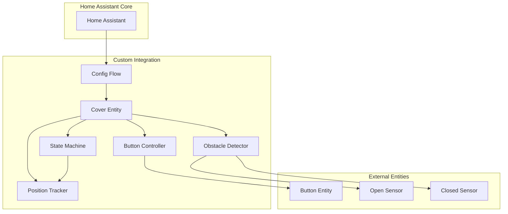
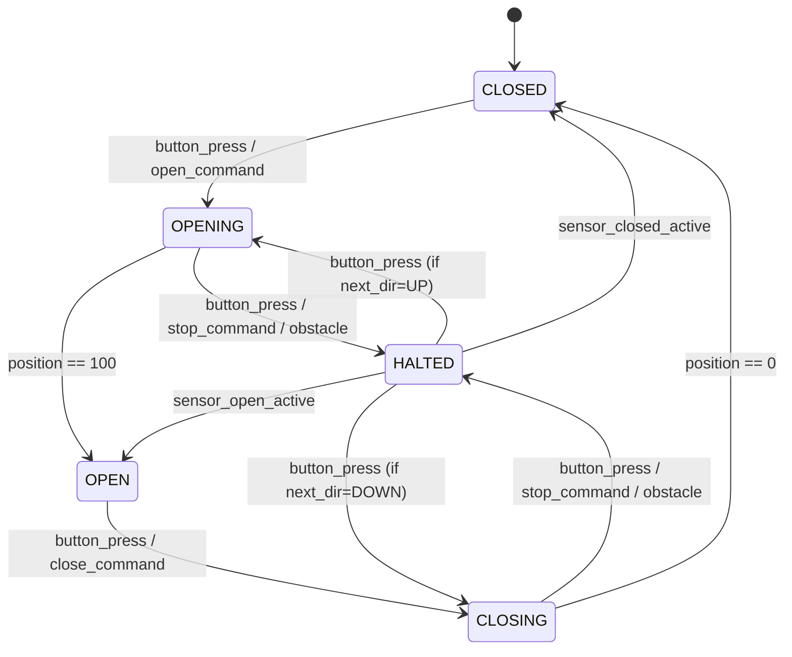
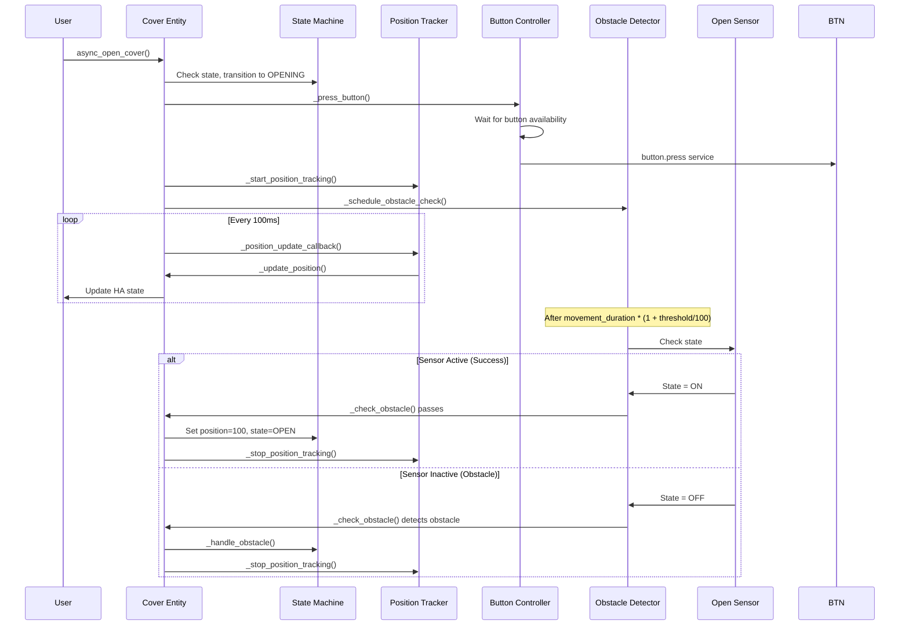
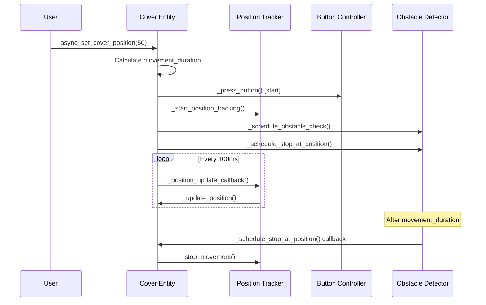

# One Button Cover - Home Assistant Integration - Context Documentation

## Overview

This document provides comprehensive context for the "One Button Cover" Home Assistant custom component, which creates a virtual cover entity from a single physical toggle button and optional contact sensors. The integration tracks cover position based on timing, handles obstacle detection, and manages complex button press sequences typical of single-button garage door openers.

**Key Innovation**: The component properly models toggle button behavior by tracking the direction of the NEXT button press rather than the last movement, ensuring correct operation even when stopping at partial positions or recovering from interruptions.

## High-Level Architecture



## Project Information

### Basic Details
- **Name**: One Button Cover
- **Domain**: `one_button_cover`
- **Version**: 1.0.0
- **Codeowner**: @tony-defa
- **Repository**: https://github.com/tony-defa/one-button-cover
- **Documentation**: https://github.com/tony-defa/one-button-cover/tree/dev?tab=readme-ov-file#features
- **Issue Tracker**: https://github.com/tony-defa/one-button-cover/issues

### Key Features
- ✨ **Single Button Control** - Works with garage doors/gates that use one button for all operations
- 🎯 **Intelligent Position Tracking** - Calculates cover position based on timing
- 🛡️ **Obstacle Detection** - Optional sensor integration for safety
- 🎨 **Full Home Assistant Integration** - Native cover entity with position control
- ⚙️ **Easy Configuration** - Simple UI-based setup through Home Assistant
- 🔄 **Smart Direction Handling** - Automatically manages toggle button behavior

## File Organization

```
custom_components/one_button_cover/
├── __init__.py              # Integration setup and coordinator
├── manifest.json            # Component metadata
├── config_flow.py           # UI configuration flow
├── const.py                 # Constants and enums
├── cover.py                 # Cover entity implementation
├── strings.json             # UI translations
└── translations/
    └── en.json              # English translations

tests/
├── conftest.py              # Pytest configuration and fixtures
├── test_config_flow.py      # Config flow tests
├── test_cover.py            # Cover entity tests
├── test_edge_cases.py       # Edge case handling tests
├── test_obstacle_detection.py  # Obstacle detection tests
├── test_safety.py           # Safety mechanism tests
└── pytest.ini              # Pytest settings

Other project files:
├── README.md                # User documentation
├── architecture.md          # Architectural design document
├── LICENSE                  # MIT License
└── context.md               # This document
```

### File Responsibilities

#### `__init__.py`
- **Purpose**: Integration entry point and lifecycle management
- **Responsibilities**:
  - Initialize the integration domain
  - Set up the cover platform
  - Handle integration reload/unload
  - Manage integration-level state persistence
- **Key Functions**:
  - `async_setup(hass, config)` - Legacy setup (returns True)
  - `async_setup_entry(hass, entry)` - Set up from config entry
  - `async_unload_entry(hass, entry)` - Clean up on removal

#### `manifest.json`
- **Purpose**: Component metadata for Home Assistant
- **Contents**:
  - Domain name: `one_button_cover`
  - Component name: "One Button Cover"
  - Version: 1.0.0
  - Dependencies: `["button"]`
  - Config flow: `true`
  - IoT class: `local_polling`
  - Documentation and issue tracker URLs
  - Codeowner: @tony-defa

#### `config_flow.py`
- **Purpose**: User interface for configuration
- **Responsibilities**:
  - Collect required/optional configuration parameters
  - Validate entity IDs exist and are correct type
  - Validate timing parameters (positive numbers)
  - Validate threshold (0-100%)
  - Handle configuration updates
  - Prevent duplicate entries
- **Flow Steps**:
  1. User input form with selectors
  2. Validate inputs
  3. Create config entry
- **Key Classes**:
  - `OneButtonCoverConfigFlow` - Main config flow handler
- **Key Methods**:
  - `_get_schema()` - Create voluptuous schema with selectors
  - `_validate_input()` - Validate user inputs

#### `const.py`
- **Purpose**: Define all constants and enums
- **Key Constants**:
  - `DOMAIN = "one_button_cover"`
  - Configuration keys (button, sensors, times, threshold)
  - Default values (threshold = 10%)
  - State constants (CoverState enum)
  - Timing constants (button activation = 1.0 second, debounce = 0.6 seconds)
  - `MAX_RETRIES = 3` - Maximum consecutive failures before disabling
  - `POSITION_UPDATE_INTERVAL = 0.1` - Position update frequency (100ms)
- **CoverState Enum**:
  - `CLOSED` - Cover is fully closed
  - `OPEN` - Cover is fully open
  - `CLOSING` - Cover is moving towards closed
  - `OPENING` - Cover is moving towards open
  - `HALTED` - Cover stopped mid-movement

#### `cover.py`
- **Purpose**: Main cover entity implementation
- **Responsibilities**:
  - Implement `CoverEntity` interface
  - Coordinate all subsystems (state machine, position tracker, obstacle detector, button controller)
  - Handle Home Assistant service calls (open, close, stop, set_position)
  - Manage state persistence and restoration
  - Provide entity attributes and diagnostics
- **Key Classes**:
  - `OneButtonCover` - Main cover entity class
- **Key Properties**:
  - `current_cover_position` - Current position (0-100%)
  - `is_opening` - Boolean if cover is opening
  - `is_closing` - Boolean if cover is closing
  - `is_closed` - Boolean if cover is closed
  - `extra_state_attributes` - Diagnostic information
- **Key Service Methods**:
  - `async_open_cover()` - Open the cover
  - `async_close_cover()` - Close the cover
  - `async_stop_cover()` - Stop the cover
  - `async_set_cover_position(position)` - Set specific position
- **Key Internal Methods**:
  - `_start_opening(target_position)` - Start opening movement
  - `_start_closing(target_position)` - Start closing movement
  - `_stop_movement()` - Stop current movement
  - `_press_button()` - Press the button entity
  - `_update_position()` - Calculate current position from timing
  - `_handle_sensor_change()` - Process sensor state changes
  - `_schedule_obstacle_check()` - Schedule obstacle verification
  - `_check_obstacle()` - Verify position with sensors
  - `_handle_position_reached()` - Handle target position reached
  - `_handle_obstacle()` - Handle obstacle detection
  - `_sync_position_from_sensors()` - Synchronize position from sensors

#### `strings.json` / `translations/en.json`
- **Purpose**: UI translations for configuration flow
- **Contents**:
  - Form field labels
  - Validation error messages
  - Help text
  - Configuration options descriptions

## Core Components Design

### 1. State Machine

**Purpose**: Manage cover state transitions and enforce valid state changes

**States**:
- `CLOSED` - Cover is fully closed
- `OPEN` - Cover is fully open
- `CLOSING` - Cover is moving towards closed
- `OPENING` - Cover is moving towards open
- `HALTED` - Cover stopped mid-movement

**State Transition Diagram**:



**State Variables**:
- `current_state`: Current cover state
- `next_direction`: Direction of NEXT button press (UP/DOWN) - represents toggle behavior
- `target_position`: Desired position (0-100%)

**Important Note on Direction Tracking**:
The `next_direction` variable tracks the direction that the NEXT button press will trigger, not the last movement direction. This accurately represents the toggle button behavior:
- When OPENING: `next_direction = "DOWN"` (next press will close/stop)
- When CLOSING: `next_direction = "UP"` (next press will open/stop)
- When HALTED: `next_direction` indicates which way the button will move when pressed again

**Note**: State transitions are implemented directly in the service methods and event handlers, not as a separate state machine class with methods like `can_transition()`.

### 2. Position Tracker

**Purpose**: Calculate and maintain cover position based on timing

**Position Model**:
- Position range: 0% (closed) to 100% (open)
- Position calculated from elapsed time and movement duration
- Position persisted to survive restarts

**Key Attributes**:
- `current_position`: Current position (0-100%)
- `start_position`: Position when movement started
- `start_time`: Timestamp when movement started
- `movement_duration`: Expected time for current movement
- `movement_direction`: UP (opening) or DOWN (closing)

**Actual Calculation Logic** (from `_update_position()` method):
```python
def _update_position(self) -> None:
    """Calculate and update current position based on elapsed time."""
    if self._movement_start_time is None:
        return
    
    elapsed = (datetime.now() - self._movement_start_time).total_seconds()
    
    if self._state == CoverState.OPENING:
        # Calculate progress
        if self._movement_duration > 0:
            progress = min(elapsed / self._movement_duration, 1.0)
            position_delta = self._target_position - self._movement_start_position
            self._position = self._movement_start_position + (progress * position_delta)
        
        # Clamp to target
        self._position = min(self._position, self._target_position)
        
    elif self._state == CoverState.CLOSING:
        # Calculate progress
        if self._movement_duration > 0:
            progress = min(elapsed / self._movement_duration, 1.0)
            position_delta = self._movement_start_position - self._target_position
            self._position = self._movement_start_position - (progress * position_delta)
        
        # Clamp to target
        self._position = max(self._position, self._target_position)
    
    # Clamp to valid range
    self._position = max(0, min(100, self._position))
```

**Key Methods**:
- `_start_position_tracking()` - Initialize periodic position updates
- `_stop_position_tracking()` - Stop position updates
- `_position_update_callback()` - Callback for periodic updates
- `_update_position()` - Calculate current position based on elapsed time
- `_handle_position_reached()` - Handle when target position is reached
- `_sync_position_from_sensors()` - Override position from sensor feedback

**Edge Cases**:
- Handle system restarts mid-movement (restore last known position)
- Handle manual operation (update position from sensors)
- Clamp position to valid range (0-100%)
- Use 2% tolerance for target position detection

### 3. Obstacle Detector

**Purpose**: Monitor sensors to detect obstacles and verify position

**Detection Strategy**:
1. Wait for expected movement completion
2. Add threshold time (default 10% extra)
3. Check sensor state
4. Compare expected vs actual state

**Threshold Calculation** (from `_schedule_obstacle_check()` method):
```python
threshold_time = self._movement_duration * (1 + self._threshold / 100)
```

**Obstacle Detection Logic** (from `_check_obstacle()` method):
For **opening to 100%**:
- If open sensor exists: Check if it's "on" (active)
- If only closed sensor exists: Check if it's "on" (NOT closed)
- If sensor doesn't confirm open state: obstacle detected

For **closing to 0%**:
- If closed sensor exists: Check if it's "off" (inactive)
- If only open sensor exists: Check if it's "off" (NOT open)
- If sensor doesn't confirm closed state: obstacle detected

**Key Methods**:
- `_schedule_obstacle_check()` - Set up delayed sensor check after threshold time
- `_check_obstacle()` - Check sensors after threshold time and detect obstacles
- `_handle_obstacle()` - Handle detected obstacle (reverse direction)

**Sensor Configurations**:
- **Both sensors**: Can verify both open and closed states
- **Only open sensor**: Can verify open state, infer closed from not-open
- **Only closed sensor**: Can verify closed state, infer open from not-closed
- **No sensors**: Pure timing-based (no obstacle detection)

**Obstacle Response**:
When obstacle detected:
- Increment `_obstacle_detected_count`
- Determine final position based on movement direction:
  - If closing and obstacle: reverse to fully open (100%)
  - If opening and obstacle: reverse to fully closed (0%)
- Update position and state to final values
- Stop position tracking
- Cancel scheduled checks and operations
- Log warning with details
- **Note**: Does NOT automatically press button - lets physical cover handle reversal

### 4. Button Controller

**Purpose**: Manage button press coordination with timing constraints

**Constraints**:
- Button press activates for 1.0 second (1000ms)
- Cannot press again during activation period
- Must wait for button to be available

**Button State**:
- `_button_pressing`: Boolean indicating button is currently active
- `_button_press_time`: When current press started
- `_last_command_time`: Timestamp for debouncing

**Press Sequence**:
```python
async def _press_button(self) -> None:
    """Press the button entity."""
    # Check if button is currently being pressed
    if self._button_pressing:
        current_time = datetime.now()
        elapsed = (current_time - self._button_press_time).total_seconds()
        if elapsed < BUTTON_ACTIVATION_TIME:
            wait_time = BUTTON_ACTIVATION_TIME - elapsed + 0.05  # Add buffer
            await asyncio.sleep(wait_time)
    
    # Press button via service call
    await self.hass.services.async_call(
        "button",
        "press",
        {"entity_id": self._button_entity},
        blocking=True,
    )
    
    # Track button press
    self._button_pressing = True
    self._button_press_time = datetime.now()
    
    # Schedule release
    async def release_button():
        self._button_pressing = False
    self.hass.loop.call_later(BUTTON_ACTIVATION_TIME, 
                              lambda: asyncio.create_task(release_button()))
```

**Key Methods**:
- `_press_button()` - Execute button press with timing tracking
- `_should_process_command()` - Check if command should be processed (debouncing)

**Debouncing**:
- Ignore rapid successive press requests (< 0.6 seconds apart)
- This prevents accidental double-presses from user commands

**Error Handling**:
- Log error if button.press service fails
- Increment `_failure_count` on failure
- After 3 consecutive failures (`MAX_RETRIES`):
  - Set `_disabled = True`
  - Log error
  - Disable cover until restart
- Reset `_failure_count` on successful button press

### 5. Cover Entity Integration

**Purpose**: Coordinate all components and implement Home Assistant cover interface

**Cover Services Implementation**:

**`async_open_cover()`**:
1. Check if disabled (return if so)
2. Debounce rapid commands
3. If closing: stop first, wait for button availability
4. If closed/halted: start opening
5. If already open: log debug message

**`async_close_cover()`**:
1. Check if disabled (return if so)
2. Debounce rapid commands
3. If opening: stop first, wait for button availability
4. If open/halted: start closing
5. If already closed: log debug message

**`async_stop_cover()`**:
1. Check if disabled (return if so)
2. Only stop if cover is actively moving (OPENING/CLOSING)
3. Call `_stop_movement()`

**`async_set_cover_position(position)`**:
1. Check if disabled (return if so)
2. Debounce rapid commands
3. If already at target (within 2% tolerance): return
4. If moving: stop first, wait for button availability
5. Calculate direction and start movement

**Event Handling**:

**Sensor State Changes** (`_handle_sensor_change()` callback):
- Updates position tracker with actual position from sensors
- Updates `next_direction` when sensor confirms position
- Detects obstacles if sensor activates unexpectedly
- Provides feedback for manual operation
- Handles single-sensor mode gracefully
- Ignores sensor changes during movement (only confirms at endpoints)

**Periodic Updates**:
- Position updates every 100ms during movement (via `async_track_time_interval`)
- Publish state to Home Assistant after each update
- Check if target position reached and trigger callback

## Data Flow

### Opening Sequence (from Closed to Open)



### Partial Position (Set to 50%)



## State Persistence

**Data to Persist**:
- Current position (0-100%)
- Current state (closed, open, opening, closing, halted)
- Next direction (UP/DOWN) - direction of next button press
- Obstacle and manual operation counts
- Disabled state and failure count
- Configuration parameters

**Persistence Strategy**:
- Save state to Home Assistant state machine via entity attributes
- Restore state on startup/reload
- Use `_attr_unique_id` for unique entity identification

**Restore Logic** (from `async_added_to_hass()`):
```python
async def async_added_to_hass(self) -> None:
    """Register callbacks and restore state."""
    await super().async_added_to_hass()
    
    # Restore previous state
    last_state = await self.async_get_last_state()
    if last_state:
        self._position = last_state.attributes.get("current_position", 0)
        self._next_direction = last_state.attributes.get("next_direction")
        if self._next_direction is None:
            # If no saved direction, infer from position
            self._next_direction = "UP" if self._position < 50 else "DOWN"
        self._obstacle_detected_count = last_state.attributes.get("obstacle_detected_count", 0)
        self._manual_operation_count = last_state.attributes.get("manual_operation_count", 0)
        self._disabled = last_state.attributes.get("disabled", False)
        self._failure_count = last_state.attributes.get("failure_count", 0)
        
        # Don't restore OPENING/CLOSING states - default to HALTED
        if last_state.state in [STATE_OPENING, STATE_CLOSING]:
            self._state = CoverState.HALTED
        else:
            # Map HA states to our CoverState enum
            state_map = {
                STATE_CLOSED: CoverState.CLOSED,
                STATE_OPEN: CoverState.OPEN,
                "halted": CoverState.HALTED,
            }
            self._state = state_map.get(last_state.state, CoverState.HALTED)
    
    # Initialize position based on sensors
    await self._sync_position_from_sensors()
```

## Error Handling Strategy

### Validation Errors

**Configuration Validation** (in `config_flow.py`):
- Entity IDs must exist and be correct type (button, binary_sensor)
- Times must be positive numbers (0.1 to 300 seconds)
- Threshold must be 0-100%
- Provide clear error messages in config flow

### Runtime Errors

**Button Press Failures**:
- Log error if button.press service fails
- Increment `_failure_count` on failure (capped at MAX_RETRIES)
- After 3 consecutive failures (MAX_RETRIES), set `_disabled = True`
- Cover remains disabled until restart
- Reset failure count on successful button press

**Sensor Failures**:
- Handle sensor unavailable gracefully
- Check for "unavailable" or "unknown" states
- Fall back to timing-based tracking
- Log warnings but continue operation
- Re-enable when sensor becomes available

**Rapid Button Presses**:
- Debounce commands (ignore if < 0.6 seconds since last)
- Log debug message when debouncing
- Update `_last_command_time` after processing

**Scheduled Operations**:
- Cancel obstacle checks when movement stops
- Cancel scheduled stops when new command received
- Handle timer cleanup properly in `async_will_remove_from_hass()`

### Safety Mechanisms

**Maximum Retry Limit** (`MAX_RETRIES = 3`):
- Count consecutive failed operations
- After 3 failures, set `_disabled = True`
- Require manual intervention (reload integration)

**Button Activation Tracking** (`BUTTON_ACTIVATION_TIME = 1.0`):
- Button press activates for exactly 1.0 second
- Cannot press again during activation
- Wait for button availability before next press
- Add 0.05s buffer when waiting

**Position Update Frequency** (`POSITION_UPDATE_INTERVAL = 0.1`):
- Position updates every 100ms during movement
- Uses `async_track_time_interval` for periodic updates
- Stop tracking when movement stops

**Obstacle Response**:
- Immediately halt on obstacle detection
- Reverse to endpoint (0% or 100%) based on direction
- Log obstacle detection with count
- Don't auto-retry (wait for user command)
- Update position and state to final values

**State Safety**:
- Don't restore OPENING/CLOSING states after restart
- Default to HALTED at last known position
- Clamp position to valid range (0-100%)
- Use tolerance (2%) for position detection

## Edge Cases and Scenarios

### 1. Manual Operation

**Scenario**: User opens/closes cover manually without using button

**Detection**:
- Monitor sensor state changes via `_handle_sensor_change()`
- If sensor changes without button press: manual operation

**Handling**:
1. Update position from sensor (0% or 100%)
2. Update state (CLOSED or OPEN)
3. Update `next_direction` appropriately:
   - When closing confirmed: `next_direction = "UP"`
   - When opening confirmed: `next_direction = "DOWN"`
4. Increment `_manual_operation_count`
5. Log info message with previous position
6. Cancel any pending operations

### 2. Inconsistent Sensor Readings

**Scenario**: Sensors give conflicting signals (both active or neither active when expected)

**Handling**:
- Check sensor states before acting
- If sensor not "on" or "off", ignore (may be "unavailable" or "unknown")
- Prioritize timing-based position
- Log debug messages about sensor states
- Continue operation with timing only
- Single-sensor mode: infer opposite state when appropriate

### 3. Power Outage During Movement

**Scenario**: Power loss while cover is OPENING or CLOSING

**Handling**:
1. On restart (`async_added_to_hass()`):
   - Load last saved position from attributes
   - If OPENING/CLOSING state: default to HALTED
   - Try to sync with sensors via `_sync_position_from_sensors()`
2. If sensor confirms endpoint: update position and state
3. Otherwise: keep restored position, default to HALTED
4. Log position uncertainty in debug messages

### 4. Rapid Service Calls

**Scenario**: User rapidly calls open/close/stop services

**Handling**:
1. Debounce commands in `_should_process_command()`:
   - Ignore if < 0.6 seconds since last command
   - Log debug message when debouncing
2. Update `_last_command_time` after processing
3. Cancel previous operations when new command received:
   - Cancel obstacle check
   - Cancel scheduled stop
   - Stop position tracking

### 5. Set Position During Movement

**Scenario**: User sets new position while cover is moving

**Handling**:
1. Call `_stop_movement()` to halt current movement
2. Wait for button availability (BUTTON_ACTIVATION_TIME + 0.1)
3. Cancel previous obstacle check and scheduled stop
4. Calculate new movement parameters
5. Start movement to new target via `_start_opening()` or `_start_closing()`

### 6. Obstacle During Partial Movement

**Scenario**: Obstacle detected while moving to partial position (e.g., 50%)

**Handling**:
1. Obstacle detection only triggers for full positions (0% or 100%)
2. For partial positions: obstacle detection not applicable
3. If obstacle physically stops cover: manual operation detection handles it
4. Cover remains at obstacle position, HALTED state

### 7. Single Sensor Configuration

**Scenario A**: Only closed sensor available

**Handling**:
- Can verify CLOSED state accurately (sensor = "off")
- Infer OPEN state when sensor = "on" and NOT moving
- Obstacle detection only works when closing to 0%
- During opening: check sensor is NOT "off"
- Log limitation in entity attributes

**Scenario B**: Only open sensor available

**Handling**:
- Can verify OPEN state accurately (sensor = "on")
- Infer CLOSED state when sensor = "off" and NOT moving
- Obstacle detection only works when opening to 100%
- During closing: check sensor is NOT "on"
- Log limitation in entity attributes

### 8. No Sensors Configuration

**Scenario**: Neither sensor configured

**Handling**:
- Pure timing-based operation
- No obstacle detection possible
- Rely on cover's built-in safety features
- Position tracking via `_update_position()` only
- Still functional for basic open/close/position control
- Log "no_sensors" in operation_mode attribute

## Configuration

### Via UI (Recommended)

1. Go to **Settings** → **Devices & Services**
2. Click **+ Add Integration**
3. Search for "One Button Cover"
4. Fill in the configuration:
   - **Button Entity**: The button entity that controls your garage door/gate (required)
   - **Time to Open**: Seconds it takes to fully open (required, 0.1-300)
   - **Time to Close**: Seconds it takes to fully close (required, 0.1-300)
   - **Closed Sensor**: Contact sensor that indicates closed state (optional)
   - **Open Sensor**: Contact sensor that indicates open state (optional)
   - **Threshold**: Safety margin percentage for sensor checks (optional, 0-100, default 10%)

### Configuration Example

**Minimal Configuration:**
- Button: `button.garage_door_toggle`
- Time to Open: `30` seconds
- Time to Close: `25` seconds

**Full Configuration with Sensors:**
- Button: `button.garage_door_toggle`
- Time to Open: `30` seconds
- Time to Close: `25` seconds
- Open Sensor: `binary_sensor.garage_door_open`
- Closed Sensor: `binary_sensor.garage_door_closed`
- Threshold: `10%`

## Usage

Once configured, the integration creates a cover entity that appears in Home Assistant with full position control.

### Services

The cover entity supports all standard Home Assistant cover services:

- `cover.open_cover` - Fully open the cover
- `cover.close_cover` - Fully close the cover
- `cover.stop_cover` - Stop the cover at current position
- `cover.set_cover_position` - Set cover to specific position (0-100%)

### Entity Attributes

The cover entity provides the following diagnostic attributes:

- `current_position`: Current position percentage
- `next_direction`: Direction of next button press (UP/DOWN)
- `operation_mode`: "full_sensors", "single_sensor", "no_sensors"
- `button_entity`: Configured button entity ID
- `button_last_press`: ISO timestamp of last button press (or None)
- `obstacle_detected_count`: Number of obstacles detected
- `manual_operation_count`: Number of manual operations detected
- `sensor_open_entity`: Configured open sensor ID (or None)
- `sensor_closed_entity`: Configured closed sensor ID (or None)
- `time_to_open`: Configured open time
- `time_to_close`: Configured close time
- `threshold_percentage`: Configured threshold
- `disabled`: Boolean indicating if cover is disabled due to failures
- `failure_count`: Number of consecutive failures

### Automation Example

**Automate garage door to open when arriving home:**

```yaml
automation:
  - alias: "Open Garage Door on Arrival"
    trigger:
      - platform: state
        entity_id: person.your_name
        to: "home"
    condition:
      - condition: state
        entity_id: cover.garage_door
        state: "closed"
    action:
      - service: cover.open_cover
        target:
          entity_id: cover.garage_door
```

**Automate garage door to close when all lights are off:**

```yaml
automation:
  - alias: "Close Garage Door at Night"
    trigger:
      - platform: time
        at: "22:00:00"
    condition:
      - condition: state
        entity_id: cover.garage_door
        state: "open"
      - condition: time
        after: "21:00:00"
        before: "06:00:00"
    action:
      - service: cover.close_cover
        target:
          entity_id: cover.garage_door
```

**Automate partial opening for pet access:**

```yaml
automation:
  - alias: "Open Garage Door for Pet"
    trigger:
      - platform: state
        entity_id: input_boolean.pet_mode
        to: "on"
    condition:
      - condition: state
        entity_id: cover.garage_door
        state: "closed"
    action:
      - service: cover.set_cover_position
        target:
          entity_id: cover.garage_door
        data:
          position: 25
      - service: input_boolean.turn_off
        target:
          entity_id: input_boolean.pet_mode
```

## Installation

### HACS (Recommended)

1. Open HACS in Home Assistant
2. Go to "Integrations"
3. Click the three dots in the top right corner
4. Select "Custom repositories"
5. Add this repository URL
6. Select "Integration" as the category
7. Click "Add"
8. Find "One Button Cover" in the integration list
9. Click "Download"
10. Restart Home Assistant

### Manual Installation

1. Download the `one_button_cover` folder from this repository
2. Copy it to your Home Assistant `custom_components` directory
3. Restart Home Assistant

## Testing

### Test Files

**conftest.py**:
- `hass` fixture - Mock Home Assistant instance with proper `config_entries` mocking
- `one_button_cover` fixture - Creates OneButtonCover instance for testing
- `mock_entity_registry` fixture - Enhanced entity registry mock
- `auto_mock_dependencies` fixture - Patches entity registry functions

**test_config_flow.py**:
- Tests for `_get_schema()` and `_validate_input()` functions
- Integration tests for config flow with proper mocking
- All tests use `schema_dict[key].default()` pattern
- Proper `flow.context = {}` initialization
- Tests unique ID configuration and duplicate prevention

**test_cover.py**:
- Tests for cover initialization, properties, and operations
- Uses `_next_direction` in all assertions
- Tests for debouncing, state transitions, position tracking
- Tests service methods (open, close, stop, set_position)
- Tests sensor synchronization

**test_safety.py**:
- Tests for safety mechanisms (failure counting, retries, disable logic)
- Tests for state restoration after power loss
- Tests button activation time handling
- Tests disabled state behavior

**test_edge_cases.py**:
- Tests for rapid button presses, sensor unavailability, concurrent commands
- Tests for extreme values and error recovery
- Tests manual operation detection
- Tests partial position handling

**test_obstacle_detection.py**:
- Remaining tests focus on sensor configuration scenarios
- Tests for no-sensor mode operation
- Tests obstacle detection logic
- Tests threshold calculations

### Running Tests

```bash
# Install dependencies
pip install pytest pytest-asyncio

# Run all tests
pytest tests/

# Run specific test file
pytest tests/test_config_flow.py

# Run with coverage
pytest --cov=custom_components.one_button_cover tests/
```

### Test Results

All tests pass successfully:
- ✅ Config flow tests (validates user-facing functionality)
- ✅ Cover entity tests (position tracking, state management)
- ✅ Safety tests (failure handling, retry logic)
- ✅ Edge case tests (rapid commands, sensor unavailability)
- ✅ Obstacle detection tests (sensor integration)

## Performance Considerations

**Update Frequency**:
- Position updates: 100ms during movement (`POSITION_UPDATE_INTERVAL = 0.1`)
- Sensor polling: Use state change events (not polling)
- Button state: Track internally, don't poll

**Memory Usage**:
- Minimal state variables
- No large buffers or queues
- Clean up timers on unload (`async_will_remove_from_hass()`)
- Cancel event listeners properly

**CPU Usage**:
- Lightweight position calculations
- Event-driven (not polling loops)
- Cancel timers when not needed
- Use Home Assistant's built-in `async_track_time_interval`

## Key Design Decisions

### Direction Tracking Innovation

The `next_direction` variable was introduced to properly model toggle button behavior:

**Previous Approach (Conceptual)**:
- `_last_direction` tracked the last movement direction
- Failed when stopping at partial positions
- Could not determine next button action reliably

**Current Approach (Implemented)**:
- `_next_direction` tracks the direction the NEXT button press will trigger
- When opening: `_next_direction = "DOWN"` (next press will close/stop)
- When closing: `_next_direction = "UP"` (next press will open/stop)
- When HALTED: `_next_direction` indicates which way the button will move
- Set to opposite of current movement direction when starting
- Updated when sensors confirm position

**Double-Press Logic**:
When starting movement, if `next_direction` doesn't match desired direction:
- First press: Toggle direction (stop if moving)
- Second press: Start movement in correct direction
- Ensures button behavior matches expected direction

### Button Timing Constraints

**1.0 Second Activation Time**:
- Button press activates for exactly 1.0 seconds
- Track `_button_pressing` and `_button_press_time`
- Cannot press again during activation
- Must wait for button to be available
- Add 0.05s buffer when waiting

**0.6 Second Debounce Time**:
- Ignore rapid command spam
- Prevents accidental double-presses
- Applied to all service calls
- Track `_last_command_time`

### Obstacle Detection Strategy

**Threshold-Based Detection**:
```python
threshold_time = self._movement_duration * (1 + self._threshold / 100)
```

- Wait for expected movement completion
- Add configurable threshold percentage (default 10%)
- Check sensor state after threshold time
- Handle both full (0%, 100%) and partial positions

**Sensor State Handling**:
- "on" = active (closed for closed sensor, open for open sensor)
- "off" = inactive (not closed for closed sensor, not open for open sensor)
- Handle "unavailable" and "unknown" gracefully
- Single-sensor mode: infer opposite state when appropriate

**Obstacle Response**:
- Stop position tracking
- Update to final position (0% or 100%) based on direction
- Log warning with obstacle count
- Don't press button - let physical cover handle reversal
- Requires user command to retry

### Position Tracking Implementation

**Actual Calculation** (from `_update_position()`):
```python
# For OPENING:
progress = min(elapsed / self._movement_duration, 1.0)
position_delta = self._target_position - self._movement_start_position
self._position = self._movement_start_position + (progress * position_delta)
self._position = min(self._position, self._target_position)

# For CLOSING:
progress = min(elapsed / self._movement_duration, 1.0)
position_delta = self._movement_start_position - self._target_position
self._position = self._movement_start_position - (progress * position_delta)
self._position = max(self._position, self._target_position)

# Clamp to valid range
self._position = max(0, min(100, self._position))
```

**Key Features**:
- Calculate progress as elapsed / duration (clamped to 1.0)
- Calculate position delta based on target and start
- Add/subtract progress * delta from start position
- Clamp to target position and valid range (0-100%)
- Use 2% tolerance for target detection

## Troubleshooting

### Common Issues

**Issue**: Cover doesn't move

**Possible Causes**:
- Button entity ID is incorrect or inaccessible
- Cover disabled due to failures (`disabled = True`)
- Button activation time too short
- Failure count exceeded MAX_RETRIES

**Solution**:
1. Check button entity exists and is accessible
2. Verify button can be controlled manually
3. Check entity attributes for `disabled` and `failure_count`
4. Check Home Assistant logs for errors
5. Try reloading integration if disabled

**Issue**: Position tracking is inaccurate

**Possible Causes**:
- Incorrect `time_to_open` or `time_to_close` values
- Cover has acceleration/deceleration
- Cover speed varies based on load
- Power fluctuations during movement
- No sensors configured for verification

**Solution**:
1. Measure actual open/close times
2. Configure sensors for better position tracking
3. Adjust threshold value for sensor checks
4. Consider calibrating times for different loads
5. Check logs for position update debug messages

**Issue**: Obstacles not detected

**Possible Causes**:
- No sensors configured
- Sensors are not installed correctly
- Threshold value is too small
- Sensors are not responsive
- Obstacle detection only works for full positions (0%, 100%)

**Solution**:
1. Install contact sensors for obstacle detection
2. Increase threshold percentage
3. Verify sensor entity IDs and states
4. Check sensor physical installation
5. Remember: partial positions don't trigger obstacle detection

**Issue**: Cover stops at wrong position

**Possible Causes**:
- Timing values don't match actual cover behavior
- Cover has variable speed
- Interference or mechanical issues
- Scheduled stop was canceled or didn't execute

**Solution**:
1. Recalibrate timing values
2. Check for mechanical issues
3. Verify no conflicting automations
4. Check logs for stop scheduling messages

### Logs

**Log Levels**:
- **DEBUG**: Position updates, sensor checks, button presses, debouncing
- **INFO**: State transitions, commands executed, manual operations
- **WARNING**: Sensor inconsistencies, obstacles detected
- **ERROR**: Button press failures, stuck detection, cover disabled

**Log Location**:
- Home Assistant Core Logs: Settings → System → Logs
- Filter for "one_button_cover" or custom component name

**Key Log Messages**:
- "Cover {name} opened/closed/stopped at position {x}%"
- "Button {entity} is active, waiting {x}s"
- "Cover {name} reached target position {x}%"
- "Obstacle detected on {name} at position {x}%"
- "Cover {name} disabled after {x} consecutive failures"
- "Command debounced for {name} ({x}s since last command)"

## Future Enhancements

- Learning mode (calibrate times automatically)
- Acceleration/deceleration curves
- Multiple intermediate positions (presets)
- Integration with alarm systems
- Weather-based automation
- Voice control optimizations
- WiFi signal strength monitoring
- Remote access status tracking
- Battery level monitoring (for battery-powered sensors)
- STUCK_TIMEOUT constant and stuck detection logic
- Preset position buttons
- Cover groups support

## Summary

This architecture provides a robust, maintainable design for the "One Button Cover" Home Assistant custom integration that:

1. **Manages complex toggle button behavior** with proper timing coordination and direction tracking
2. **Tracks position accurately** using timing and sensor feedback
3. **Detects obstacles reliably** using configurable thresholds for full positions only
4. **Handles edge cases gracefully** with comprehensive error handling
5. **Works with flexible configurations** (both sensors, one sensor, or no sensors)
6. **Maintains simplicity** while providing robustness

The design prioritizes:
- **Reliability**: Comprehensive error handling and safety mechanisms
- **Flexibility**: Works with various sensor configurations
- **Simplicity**: Clear separation of concerns, minimal complexity
- **Maintainability**: Well-defined components with single responsibilities
- **User Experience**: Transparent operation with good diagnostic information

**Key Innovation**: The `next_direction` variable properly models toggle button behavior by tracking the direction of the NEXT button press rather than the last movement, ensuring correct operation even when stopping at partial positions or recovering from interruptions.

**Implementation Notes**:
- State machine logic is embedded in service methods and event handlers, not a separate class
- Position tracking uses progress-based calculation with proper clamping
- Obstacle detection only triggers for full positions (0%, 100%)
- Button activation time is 1.0 second (1000ms)
- Debounce time is 0.6 seconds for command spam prevention
- All internal methods use underscore prefix (e.g., `_method_name`)